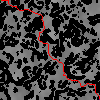
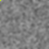
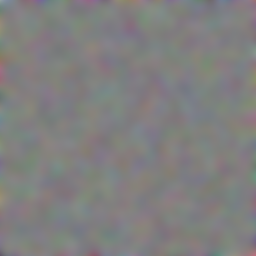
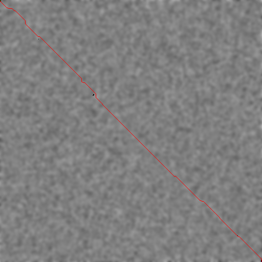
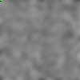

# Rover PathPlanner 2025

This repository contains two implementations of the same autonomous terrain planner:
* a reference Python prototype that uses NumPy and Pillow for image driven A* path planning
* a Rust port that mirrors the Python package layout but adds profiling, tracing and better performance

Both versions share identical configuration defaults so you can compare behaviour, speed and visual output side by side.

## Sample outputs

Python run (`pathplanner/output/`):





Rust run (`rustfinder/output/`):





## Why this project

The original software department challenge (described in `TASKS.md`) asked us to guide a rover across a 100x100 height map, obeying a 30deg slope limit. The work evolved in three phases:
1. Python prototype (documented in `IDEAS.md`) that builds the image pipeline, cost-map and baseline A*.
2. Visual tooling: red-channel filtering, cost heat map, blocked cell overlays and animated GIF playback of the search.
3. Rust rewrite that keeps the same architecture, then layers in bidirectional A* with slope-aware cost scaling, sampling controls and end-point tolerance. Benchmarks in `TIME.md` show the Rust binary running roughly twice as fast as the Python script.

The repository keeps both code paths so the evolution is easy to audit and compare.

## Project structure

```
pathplanner/         # Python package
  config.py          # shared configuration defaults
  finder/            # bidirectional A*, conversion helpers, tracing hooks
  image/             # synthetic map generation, filtering, animation
  main.py            # end-to-end pipeline entry point

rustfinder/          # Cargo project with mirrored modules
  src/
    config.rs        # same defaults as config.py
    finder/          # bidirectional A*, tracing structs
    image/           # image IO, GIF renderer
    main.rs          # Rust entry point with CLI flags

IDEAS.md             # design notes for each milestone
TASKS.md             # original challenge brief
TIME.md              # quick benchmark snapshot
README.md            # you are here
```

## Features

* Synthetic terrain generation (Gaussian blurred RGB noise with red-channel extraction)
* Heightmap conversion from pixel intensity to metres, followed by gradient-aware cost weighting
* Bidirectional A* search with:
  * slope filtering on each edge
  * movement modes (4 or 8 directions)
  * configurable trace sampling to control animation size
  * goal tolerance radius (default 5px) so runs stop once any cell close to the target is reached
* Step-by-step tracing API that powers both console logging and GIF playback
* Identical configuration surface across Python and Rust implementations

## Configuration

Key fields from `config.py` / `src/config.rs`:

| Setting | Default | Description |
| --- | --- | --- |
| `IMAGE_SIZE` | 100 | Generated map width/height in pixels |
| `BLUR_SIZE` | 3.0 | Gaussian blur radius for terrain smoothing |
| `HEIGHT_MIN_M` / `HEIGHT_MAX_M` | 0 / 3 | Height range used when converting the red channel |
| `PIXEL_SIZE_M` | 0.1 | Physical scale per pixel |
| `MAX_SLOPE_DEG` | 30 | Maximum climb angle |
| `SLOPE_COST_WEIGHT` | 100 | Additional traversal cost applied for steep slopes |
| `REMAINING_DISTANCE_WEIGHT` | 5 | Heuristic multiplier for A* |
| `TRACE_SAMPLE_STRIDE` | 50 | How many A* steps to skip between stored snapshots |
| `END_TOLERANCE_PX` | 5 | Radius around the goal that is considered “close enough” |

Edit `config.py` to tweak the Python run. The Rust binary reads the same values from `src/config.rs`.

## Running the Python pipeline

```
cd pathplanner
uv run ./main.py
```

Outputs:
* `output/noisy.png` – generated terrain
* `output/red.png` – red-channel heightmap
* `output/path.png` – final route overlay with blocked cells
* `output/search.gif` – search animation (only when trace samples are captured)

Console output lists timing (`Search time`, `Total pipeline time`) for quick iteration.

## Running the Rust pipeline

```
cd rustfinder
cargo run . --trace --release
```

The Rust binary writes the same image and GIF artefacts into `rustfinder/output/`.

## Comparing Python vs Rust

`TIME.md` holds a quick timing snapshot (Rust ~2.45s vs Python ~3.81s on the author’s machine). To repeat:
1. Run `uv run ./main.py` and note the printed `Search time`.
2. Run `cargo run . --trace --release` and note the reported timings.

Both runs use the same config defaults so the path, generated artefacts and GIF should match closely.